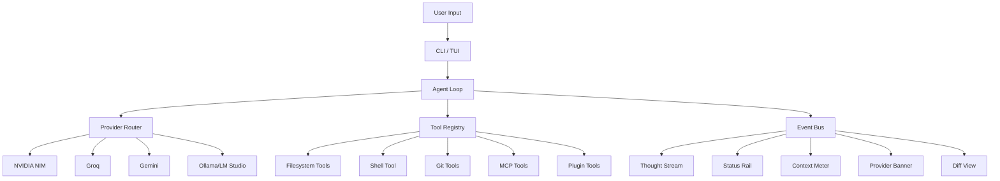
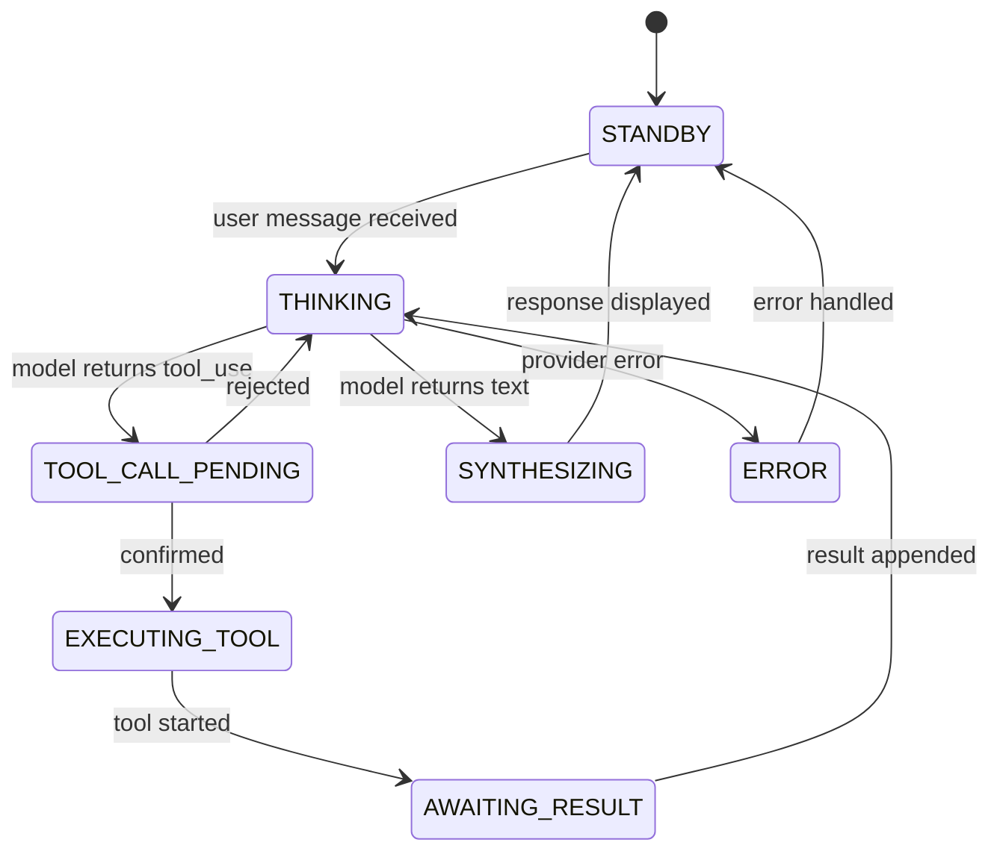

# CODE-Y Architecture

## Overview

CODE-Y is a terminal-native, provider-agnostic AI coding agent that operates as a REPL-style tool for reading/writing files, running shell commands, and editing code across a project, driven by natural language.

## System Architecture



## Core Data Flow

```
User Input → Agent Loop → Provider Router → LLM Provider
                ↑                                  ↓
           Tool Results ← Tool Registry ← Tool Calls
                                                   ↓
                                            Event Bus → UI Widgets
```

## Agent Loop State Machine



Every state transition emits to the Event Bus, enabling real-time UI updates.

## Provider Failover Sequence

```mermaid
sequenceDiagram
    participant Loop as Agent Loop
    participant Router as Provider Router
    participant NIM as NIM Provider
    participant Groq as Groq Provider
    participant Bus as Event Bus
    participant UI as UI Widgets

    Loop->>Router: complete(messages, tools)
    Router->>NIM: chat.completions.create()
    NIM-->>Router: TimeoutError (25s)
    Router->>Bus: PROVIDER_FAILOVER event
    Bus->>UI: Update banner + status rail
    Router->>Groq: chat.completions.create(same messages)
    Groq-->>Router: Response
    Router-->>Loop: Response (from Groq)
```

Key: Full normalized conversation history is replayed to the new provider on failover — no context is lost.

## Directory Structure

```
codey/
├── pyproject.toml
├── README.md
├── codey/
│   ├── cli.py                     # Typer CLI: codey chat, codey run, codey init
│   ├── config/
│   │   ├── schema.py               # Pydantic v2 config models
│   │   ├── loader.py               # 3-layer config merge (default → global → project)
│   │   └── default_config.yaml
│   ├── providers/
│   │   ├── base.py                 # Abstract Provider (OpenAI SDK wrapper)
│   │   ├── nim_provider.py         # NVIDIA NIM
│   │   ├── groq_provider.py        # Groq
│   │   ├── gemini_provider.py      # Gemini (OpenAI-compatible endpoint)
│   │   ├── local_provider.py       # Ollama / LM Studio
│   │   └── router.py              # Failover engine + health tracking
│   ├── agent/
│   │   ├── loop.py                 # State machine agent loop
│   │   ├── message_types.py        # Normalized Message/ToolCall/StreamDelta
│   │   ├── context_manager.py      # Token counting + sliding window compression
│   │   ├── system_prompt.py        # Prompt builder with override chain
│   │   └── prompts/
│   │       └── default_system_prompt.md
│   ├── tools/
│   │   ├── base.py                 # Tool ABC
│   │   ├── fs_tools.py             # read_file, write_file, edit_file, list_dir, search
│   │   ├── shell_tool.py           # run_command with allowlist
│   │   ├── git_tools.py            # git_status, git_diff, git_commit, git_log
│   │   └── registry.py            # Unified tool registry (native + MCP + plugins)
│   ├── mcp/
│   │   ├── client_manager.py       # Spawns/connects MCP servers, discovers tools
│   │   └── mcp_config.yaml         # Claude Desktop-compatible server config
│   ├── plugins/
│   │   ├── plugin_spec.py          # Plugin manifest + interface contract
│   │   └── plugin_loader.py        # Discovery, import, registration
│   ├── ui/
│   │   ├── theme.py               # Orange & Black color tokens
│   │   ├── app.py                  # Textual App root + event wiring
│   │   ├── input_bar.py
│   │   └── widgets/
│   │       ├── status_rail.py      # Provider + context + recent tools
│   │       ├── thought_stream.py   # Live reasoning + tool call display
│   │       ├── diff_view.py        # Pre-write diff confirmation
│   │       ├── context_meter.py    # Token usage bar
│   │       └── provider_banner.py  # Failover notification
│   └── telemetry/
│       └── event_bus.py            # Async pub/sub for agent → UI
└── docs/
    └── ARCHITECTURE.md
```

## Key Design Decisions

1. **All providers use the OpenAI SDK** — NIM, Groq, Gemini, and local servers all expose OpenAI-compatible endpoints. One SDK, different `base_url`s.

2. **Normalized message format** — All conversation history is stored as provider-agnostic `Message` objects. Provider adapters translate at the edges, enabling seamless failover mid-task.

3. **Event bus from day one** — The `EventBus` is not an afterthought. Every agent state transition, tool call, and failover is published to it. UI widgets subscribe reactively.

4. **Tool registry is source-agnostic** — The agent loop calls `registry.execute(name, args)` and never knows whether a tool is native Python, an MCP server, or a plugin.

5. **Health-based routing** — The router tracks rolling error rates and latencies per provider, dynamically reordering the chain. This is more sophisticated than static failover.

## Extension Points

- **Plugins**: `~/.codey/plugins/<name>/` with `plugin.yaml` manifest and `register()` entrypoint
- **MCP servers**: `~/.codey/mcp_config.yaml` in Claude Desktop format
- **System prompts**: Override at project level (`.codey/system_prompt.md`) or global (`~/.codey/system_prompt.md`)
- **Custom providers**: Extend `Provider` base class with any OpenAI-compatible endpoint
